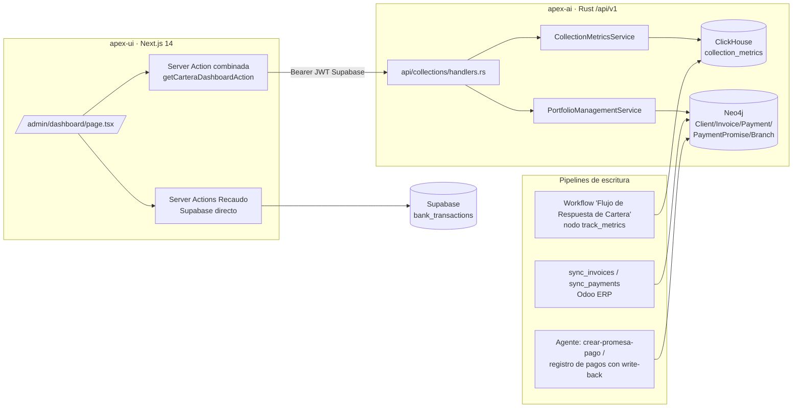
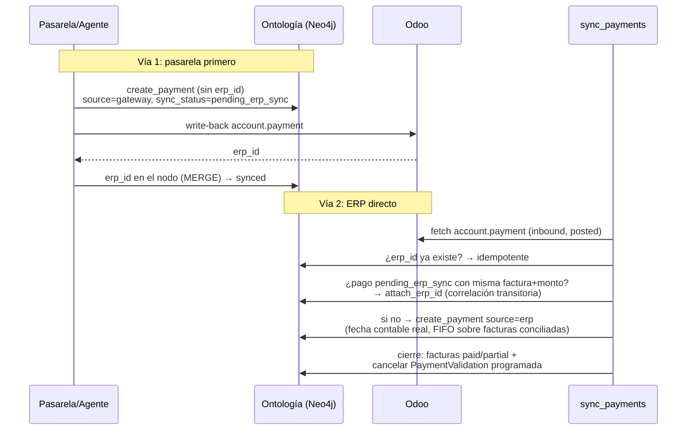

# ADR-0001: Arquitectura del dashboard de cartera (Indicadores + Recaudo)

- **Estado**: aceptado
- **Fecha**: 2026-07-14
- **Decisores**: Bryan Rios (Ingeniería BORLS)
- **Historia técnica**: `apex-ai/requirements/plans/collection-metrics-dashboard.md`,
  `apex-ai/requirements/plans/due-date-forecast-branch-policy.md`
- **Repos**: backend `apex-ai` (Rust, DDD/hexagonal) · frontend `apex-ui`
  (Next.js 14 App Router)

## Contexto y problema

APEX gestiona cobranza (cartera) con agentes de IA: un workflow conversacional
clasifica la intención del cliente (comprobante de pago, promesa de pago,
reclamo, retenciones, estado de cuenta), resuelve o escala a aprobación humana
(HITL) y registra métricas de cada interacción. La operación necesita un
tablero en `/admin/dashboard` que responda tres preguntas: **¿cuánta cartera
vencida hay y qué tan cubierta está con promesas?**, **¿qué tan efectivo es el
agente?** y **¿cuánto dinero va a entrar y cuándo?**

Al iniciar esta iniciativa existían endpoints de KPIs pero con tres defectos
estructurales: los indicadores de `collection_metrics` llegaban todos en cero
(el pipeline solo persistía la intención), el aging de cartera siempre daba
$0 (filtro Cypher sobre un estado de factura que ningún flujo escribía), y el
forecast dependía de nodos `PaymentPromise` correctos pero los pagos no se
sincronizaban desde el ERP, impidiendo el estándar de precisión financiera que
exige el negocio (habrá pasarela de pagos: un pago puede entrar por la
pasarela o directo al ERP y ambos caminos deben converger).

## Decision drivers

- **Precisión financiera**: el tablero muestra dinero; cero tolerancia a
  dobles conteos o estados desincronizados ERP ↔ ontología.
- **Extender, no modificar**: la plataforma está en operación; las mejoras no
  pueden romper flujos existentes (Open/Closed).
- **Reutilización**: apex-ui ya tiene echarts, shadcn/ui y patrones de server
  actions; apex-ai ya tiene el workflow de cartera y el pipeline de sync Odoo.
- **Logic-as-data**: agentes, tools y workflows viven como datos (ClickHouse/
  Neo4j), no como código; la infraestructura debe ser genérica.
- **Parametrizable por sucursal**: la política de cobro (días de gracia,
  reintentos) es del negocio, no del código.

## Arquitectura general

- **Lectura**: 4 endpoints REST bajo `/api/v1/collections` — `GET /kpi`
  (KPIs generales), `GET /kpi/effectiveness` (intenciones/confianza), ambos
  sobre ClickHouse; `GET /kpi/aging` y `GET /forecast` sobre Neo4j. El
  `business_id` se resuelve del JWT de Supabase (SSO), no de headers.
- **Escritura**: (a) el nodo `track_metrics` del workflow registra
  `collection_metrics` en ClickHouse al final de cada interacción; (b) el
  sync de Odoo puebla facturas y pagos en Neo4j; (c) el agente crea promesas
  de pago y registra pagos con write-back al ERP.

## Decisiones

### D1 — Fuentes de datos: ClickHouse para métricas de interacción, Neo4j para cartera

**Opciones**: (1) todo en ClickHouse; (2) todo en Neo4j; (3) híbrido según la
naturaleza del dato.

**Decisión: híbrido (3).** Las métricas de interacción (`collection_metrics`)
son eventos append-only con agregaciones columnares — terreno de ClickHouse
(`ReplacingMergeTree(created_at)`, `ORDER BY (business_id, customer_id,
thread_id, id)`, DDL versionado en `scripts/clickhouse/008_collection_metrics.sql`).
La cartera (clientes, facturas, pagos, promesas, canales) es un grafo de
relaciones que el agente recorre — terreno de Neo4j, compartido con la
ontología del agente. Mover uno al otro duplicaría datos o degradaría queries.

### D2 — Pipeline de métricas: derivación desde el estado del workflow, no del LLM

**Problema**: el tool `registrar-metricas-cartera` (nodo `function` del
workflow) recibía el estado del grafo como args, pero `confidence`,
`resolved_automatically`, `hitl_required`, `response_time_ms` y `kpi_types`
nunca llegaban → 100% de las filas en cero salvo `intent`.

**Opciones**: (1) instruir al LLM para pasar los argumentos; (2) derivar los
indicadores del estado del workflow en infraestructura; (3) marcar HITL en el
`hitl_gate` al aprobarse.

**Decisión: derivación desde el estado (2), con el marcador de HITL en el
resume del motor — la opción (3) se implementó y se revirtió** porque el gate
también "pasa" con valores auto-aprobados por tools (p. ej.
`crear-promesa-pago` bajo umbral escribe `promise_approved=true` y
`hitl_required=false`); marcarlo ahí corrompía `hitl_rate` para toda la ruta
de auto-aprobación. La opción (1) es no determinista: un LLM no debe ser la
fuente de métricas financieras.

Mecánica resultante (contrato de claves en
`agents/src/infrastructure/services/mod.rs::workflow_state_keys`):

| Indicador | Derivación (fallback si no llega como arg explícito) |
| --- | --- |
| `confidence` | `confidence` ∥ `intent_confidence` (canal del clasificador) |
| `hitl_required` | `hitl_required` (lo reporta el tool que evaluó el umbral) ∥ `__hitl_resumed` (el motor lo marca en cada resume tras interrupción = aprobación humana real) |
| `resolved_automatically` | explícito ∥ `!hitl_required`, **solo** en contexto de workflow (`__job_id` presente); en invocación directa conserva `false` |
| `response_time_ms` | explícito ∥ `now − __job_started_at`; el timestamp se inyecta **solo en arranques nuevos** (el resume mezcla el input sobre el checkpoint y un timestamp fresco excluiría la espera HITL) |
| `kpi_types` | `config` del nodo del workflow, mezclado como **defaults** de args (`merge_node_config_defaults`: el estado tiene precedencia) |

El merge de config además activó los configs de nodos que existían y eran
ignorados (`require_hitl_for_amount_above`, `base_offset_days`, …): el
comportamiento del workflow ahora es gobernable desde su definición JSON sin
recompilar.

### D3 — Política de cobro por sucursal: dos parámetros explícitos en `Branch.notifications`

**Opciones**: (1) un parámetro unificado para primera validación y
reintentos; (2) dos parámetros explícitos; (3) solo parametrizar la primera
validación.

**Decisión: dos parámetros (2)**, porque gobiernan momentos distintos del
flujo: `grace_days` (días de gracia tras `due_date` antes de la **primera**
validación de pago) y `validation_retry_days` (cadencia de **reintentos**
cuando la factura sigue impaga). Viven en el JSON `b.notifications` del nodo
`Branch` (semilla de sign-up:
`{"grace_days":1,"validation_retry_days":3,...}`), leídos vía
`CollectionStorage::get_branch_grace_days` / `get_branch_validation_retry_days`
con constantes de dominio como fallback (`DEFAULT_GRACE_DAYS=1`,
`DEFAULT_VALIDATION_RETRY_DAYS=3`). Precedencia de la primera validación:
**threshold activo de Supabase > `grace_days` de la Branch > default**.

### D4 — Pagos bidireccionales con conciliación por `erp_id`

**Problema**: los nodos `:Payment` solo nacían del write-back del agente (con
fecha de registro, no la contable) y no existía ingesta de `account.payment`;
con la futura pasarela, un pago puede entrar por dos caminos.

**Opciones**: (1) ERP como única vía de entrada (la pasarela escribe solo al
ERP); (2) doble vía convergente: la pasarela crea el pago primero en la
ontología y sincroniza al ERP, y los pagos ERP-directos se sincronizan hacia
la ontología cerrando las acciones de cobro.

**Decisión: doble vía (2)** — requisito de negocio explícito. Mecánica:

- Clave primaria de conciliación: `MERGE (p:Payment {erp_id})`. Correlación
  transitoria (ventana pasarela→ERP): factura conciliada + monto ± $0.01.
- Propiedades de trazabilidad: `p.source` (`gateway|agent|erp`),
  `p.sync_status` (`pending_erp_sync|synced`), `p.payment_date` (contable).
- El cierre de acciones marca facturas en el **mismo orden FIFO** (mayor mora
  primero) que la asignación del pago, y cancela el job de validación
  programado (`payment_validation_job_id` + `ScheduleJobUseCase.cancel_job`).
- Operación nueva `sync_payments` (`POST /collections/sync`), sin tocar
  `sync_invoices` (Open/Closed). Pagos sin conciliar en el ERP se omiten con
  contador explícito (`skipped_unreconciled`), nunca se adivinan.

### D5 — Frontend: tab nuevo con server action combinada y echarts

**Opciones de estructura**: (1) extender el tab Recaudo; (2) tab nuevo
"Indicadores" conviviendo con Recaudo; (3) reemplazar el dashboard.

**Decisión: tab nuevo (2).** Recaudo responde "¿qué plata entró?" desde
`bank_transactions` (Supabase, transaccional); Indicadores responde "¿cómo va
la gestión y qué viene?" desde apex-ai (ClickHouse/Neo4j, analítico). Fuentes
y preguntas distintas → tabs distintos. El tab **Campaña se ocultó sin
eliminarse** tras el flag `SHOW_CAMPAIGN_TAB=false` (sus cargas de datos y su
suscripción realtime también se pausan).

Decisiones de implementación:

- **Data fetching**: una única server action `getCarteraDashboardAction()`
  que ejecuta los 4 GETs con `Promise.all` **en el servidor**. Razón: Next.js
  serializa las POSTs de server actions desde el cliente; 4 actions en
  `Promise.all` del cliente = 4 round-trips seriales (~4× latencia de
  skeletons). Cada endpoint degrada a `null`/`[]` ante error: el tablero
  muestra estados vacíos, nunca rompe.
- **Charts**: `echarts` vía `dynamic(() => import('echarts-for-react'),
  { ssr: false })` (patrón preexistente del repo). Options bajo `useMemo`
  keyed por data — echarts-for-react hace deep-compare del option y los
  formatters recreados en cada render forzarían `setOption`/repaint completo.
- **Layout de cards**: un único wrapper `Card` (`rounded-none border`, la
  estética del tab Recaudo tomada como referencia) con header fijo
  (título + subtítulo) y contenido conmutado `loading → Skeleton | datos →
  chart | vacío → mensaje`; el header fijo evita saltos de layout (CLS) al
  cargar.
- **Formatos compartidos**: `formatCurrency` / `formatCompact` de
  `lib/utils/currency.ts` (COP, `es-CO`, sin decimales) — sin copias locales.

## D6 — Detalle de cada gráfico del tab Indicadores

### 6.1 · Fila de KPI cards (`CarteraKpiCards`)

Grid responsive `md:2 / lg:4` columnas. No es un chart: son los 4 números que
la operación debe ver sin interpretar nada.

| Card | Dato | Fuente | Presentación |
| --- | --- | --- | --- |
| **Cartera Vencida** | `aging.total_outstanding` | Neo4j (aging) | Moneda COP, color primario. Subtítulo "Facturas pendientes con mora" |
| **Con Promesa de Pago** | `aging.total_with_promise` | Neo4j (aging) | Moneda + `%` de cobertura sobre la cartera vencida (`AnimatedPercentage`) |
| **Interacciones Gestionadas** | `kpi.total_interactions` | ClickHouse | Contador animado + tiempo de respuesta promedio formateado adaptativo (ms → s → min) |
| **Resolución Automática** | `kpi.auto_resolution_rate` | ClickHouse | Porcentaje (fracción×100) + tasa de intervención humana (`hitl_rate`) como dato secundario |

Estados: `Skeleton` por card durante la carga; `0`/`—` con datos vacíos.

### 6.2 · Antigüedad de Cartera (`AgingBucketsChart`)

- **Pregunta**: ¿dónde está envejeciendo el dinero y cuánto está prometido?
- **Forma**: barras **agrupadas** (no apiladas: el monto con promesa es un
  subconjunto del vencido, apilar sumaría) sobre 4 buckets fijos de mora:
  `0-30`, `31-60`, `61-90`, `90+` días. Los buckets se **normalizan en el
  cliente**: el backend omite buckets vacíos y el eje X debe ser estable.
- **Series**:
  1. *Monto vencido* — color **semántico por severidad** de la mora:
     `#10b981` (verde, 0-30) → `#f59e0b` (ámbar, 31-60) → `#f97316`
     (naranja, 61-90) → `#ef4444` (rojo, 90+).
  2. *Con promesa de pago* — violeta `#8b5cf6` constante (es la misma
     métrica en todos los buckets).
- **Ejes**: Y en notación compacta es-CO (`3,6 M`); X con etiqueta `N-M días`.
- **Tooltip**: por eje (`axisPointer: shadow`), montos en COP completos.
- **Contrato de datos** (`GET /collections/kpi/aging`):
  `{ total_outstanding, total_with_promise, buckets: [{ bucket, amount,
  amount_with_promise }] }`. Reglas del cálculo (Cypher): solo facturas
  `pending|partial` **con `days_overdue > 0`** (la cartera corriente no es
  mora); promesas `active|pending_approval` **agregadas por factura** antes
  de sumar (evita duplicar `amount_due` cuando una factura tiene N promesas).
- **Vacío**: "Sin cartera vencida registrada".

### 6.3 · Intenciones de los Clientes (`IntentsDistributionChart`)

- **Pregunta**: ¿qué pide la gente y qué tan seguro está el clasificador?
- **Forma**: **donut** (`radius ['45%','70%']`, centro al 32% para dejar la
  leyenda vertical a la derecha), segmentos ordenados por frecuencia
  descendente. Es composición de un total pequeño de categorías (≤6) — el
  caso correcto para un donut.
- **Etiquetas de dominio**: mapeo estable intención→español
  (`payment_proof` → "Comprobante de pago", `promise_to_pay` → "Promesa de
  pago", `billing_claim` → "Reclamo de facturación", `withholding` →
  "Retenciones", `account_status` → "Estado de cuenta", `unclear` → "No
  clasificada"); las intenciones desconocidas caen al nombre crudo.
- **Paleta categórica**: `#8b5cf6, #3b82f6, #f59e0b, #10b981, #ec4899,
  #6b7280` (la de reports del repo; gris al final para "No clasificada" en la
  práctica por orden de frecuencia).
- **Subtítulo dinámico**: "Confianza promedio del clasificador: X%" cuando
  `average_confidence > 0` (proviene del promedio de `avg(confidence)` por
  intención en ClickHouse); si no, texto descriptivo.
- **Tooltip**: `nombre: N interacciones (P%)`.
- **Contrato** (`GET /collections/kpi/effectiveness`):
  `{ intents_distribution: Record<intent, count>, average_confidence: 0..1 }`.
  Nota: filas con `intent` vacío se excluyen en el SQL (`WHERE intent != ''`).
- **Vacío**: "Sin interacciones registradas".

### 6.4 · Proyección de Recaudo (`CashForecastChart`)

- **Pregunta**: ¿cuánto dinero se espera y qué tan respaldado está?
- **Forma**: combinado **barras + línea con doble eje Y** — la respuesta
  tiene dos unidades (pesos y conteo) y correlacionarlas es el insight: una
  barra alta sostenida por una sola promesa es más riesgosa que la misma
  cifra repartida en muchas.
  - Barras azules `#3b82f6` (eje izquierdo "Monto", compacto es-CO):
    `projected_amount` por fecha de compromiso.
  - Línea violeta `#8b5cf6` suavizada (eje derecho "Promesas",
    `minInterval: 1` para ticks enteros): `promise_count`.
- **Consolidación en cliente**: el backend agrupa por fecha **y** segmento
  (`week_start, segment, risk_cluster`); el tablero suma por fecha (Map) y
  ordena cronológicamente. El desglose por segmento/riesgo queda disponible
  para una vista futura sin cambiar la API.
- **Eje X**: `dd MMM` en español (`date-fns/locale/es`), fechas ISO parseadas
  a medianoche local para evitar off-by-one de timezone.
- **Contrato** (`GET /collections/forecast`): `[{ week_start, segment,
  risk_cluster, projected_amount, promise_count }]` — promesas Neo4j
  `active|pending_approval` agrupadas por `date(commitment_date)`.
- **Vacío**: "Sin promesas de pago activas para proyectar" (estado esperado
  hasta que el agente registre promesas).
- **Evolución decidida** (plan Fase 3-4): segunda serie de barras "Esperado
  por vencimientos" (verde `#10b981`) calculada como `due_date +
  grace_days(Branch) + avg_payment_delay_days(cliente)` — comparación directa
  semana a semana entre lo *comprometido* (promesas) y lo *esperado*
  (vencimientos + comportamiento). Se eligió "mismo chart, dos series" sobre
  un toggle o un chart aparte, precisamente para esa comparación.

### 6.5 · Tab Recaudo (preexistente, intacto)

Referencia de estilo del tab Indicadores. Componentes: `RecaudoAlerts`
(pagos sin identificar), `RecaudoStatsCards` (total mes, hoy, sin
identificar, tasa de identificación) y `RecaudoByBank` (barras de progreso
por banco). Fuente: server actions → Supabase `bank_transactions` directo.
No consume apex-ai.

## Consecuencias

**Positivas**

- KPIs del agente ahora se registran completos y de forma determinista (la
  infraestructura deriva; el LLM no es fuente de métricas).
- Aging y forecast reflejan datos reales; el aging quedó protegido por un
  test de integración contra Neo4j (facturas con/sin mora, pagadas, promesas
  múltiples sin duplicar montos).
- La convergencia de pagos está garantizada por diseño (MERGE por `erp_id` +
  correlación transitoria) y cubierta por tests de integración de ambas vías.
- La política de cobro es del negocio (nodo Branch), no del código.
- Dashboard resiliente: cualquier endpoint caído degrada a estado vacío.

**Negativas / deuda aceptada**

- Los endpoints de KPI resuelven el business desde el JWT e **ignoran la
  sucursal seleccionada en la UI**; con multi-sucursal real habrá que aceptar
  un `business_id` explícito validado contra el tenant.
- Las ~70 filas históricas de `collection_metrics` quedan en cero
  (irreconstruibles); los KPIs convergen con las interacciones nuevas.
- El vocabulario "factura con saldo exigible" sigue inline en 3 queries con
  criterios distintos (aging, fraud, validación); pendiente converger en una
  constante de dominio derivada de `InvoiceStatus`.
- El fallback `confidence ← intent_confidence` acopla infraestructura a un
  nombre de canal de un workflow concreto; workflows futuros deben mapear vía
  `state_transform` o config del nodo.
- `sync_payments` requiere `reconciled_invoice_ids` (Odoo ≥ 13); pagos no
  conciliados se omiten explícitamente. Odoo < 12 no soportado en esta fase.
- Pendientes de la iniciativa (plan Fases 3-5): endpoint de forecast por
  vencimientos, segunda serie en el chart, `payment_term_days`/`credit_limit`
  como propiedades, job de `avg_payment_delay_days`, y GDS (`risk_cluster`
  con K-Means; clasificación de probabilidad de cumplimiento de promesas).

## Referencias

- Backend: `api/src/collections/handlers.rs`,
  `ontology/src/infrastructure/collection/{clickhouse_metrics,portfolio_management}.rs`,
  `agents/src/infrastructure/services/{agent_graph_workflow_factory,agent_adk_graph_execution}.rs`,
  `agents/src/infrastructure/services/builders/ontology.rs`,
  `integrations/src/application/use_cases/{sync_erp_payments,validate_payment}.rs`,
  `integrations/src/infrastructure/ontology/collection.rs`,
  `scripts/clickhouse/008_collection_metrics.sql`.
- Frontend: `app/admin/dashboard/page.tsx`,
  `components/dashboard/collection/{CarteraKpiCards,AgingBucketsChart,IntentsDistributionChart,CashForecastChart}.tsx`,
  `lib/actions/collection/metrics.ts`, `lib/utils/currency.ts`.
- Tests: `ontology/tests/portfolio_management_test.rs` (aging),
  `integrations/tests/payment_convergence_test.rs` (convergencia de pagos),
  unitarios en `builders/ontology.rs` y `sync_erp_payments.rs`.
- Planes: `requirements/plans/collection-metrics-dashboard.md`,
  `requirements/plans/due-date-forecast-branch-policy.md`.
